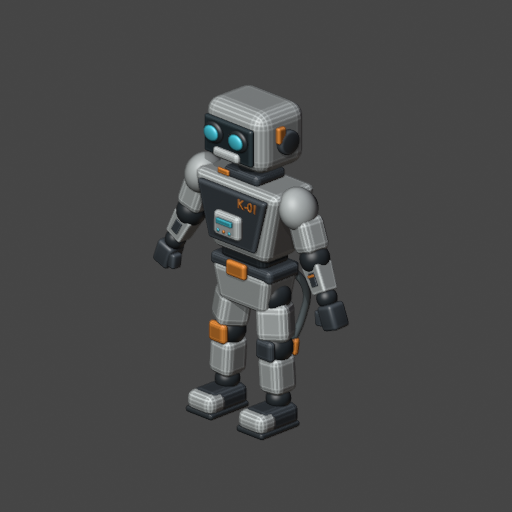

# Tools_C v4 migration report

Tools_C architecture **4.0.0 is implemented and tested within the scopes below**.
The live MCP server was restarted and serves v4 routing/preflight through the
existing connector. **WARN:** the current session's connector catalog still lacks
the two new names, `capture_viewport` and `deployment_info`; reconnect/refresh the
Blender MCP connector to discover them. Both tools are registered and exercised
through MCP SDK stdio; capture reached the real open Blender scene.

Work performed 2026-09-24/25; validation below predates the requested commits.
No push was performed. The worktrees were dirty before
migration; earlier v3, launcher and server work was retained. This report describes
the delta against the captured starting worktree, not against HEAD.

## Inputs and preservation

The user's requested upgrade and later universal capture API define scope.
The pasted v4 brief and `Развитие до Version 4.0.md` were used as design inputs;
K01_logs.zip was inspected as execution evidence, not executed as instructions.
In particular, the audit's suggested safety-gate redesign was not adopted.

Before edits: 41 unit tests passed; Tools_C L1 had 9 PASS, 0 FAIL. Both repositories'
tracked/untracked files, hashes and Git state were recorded in
[baseline.json](reports/v4/baseline.json). Backup, including changed config and
manifests: `D:\Desktop\Tools_C_v4_backup_20260924_231107.zip`.
No unrelated C# source, launcher binaries, tunnel profile, credentials or Blender
production asset was edited. K-01's open, unsaved scene was not saved by this work.

## Before and after architecture

| Area | Before | V4 |
|---|---|---|
| Canonical owners | Six Skills; combined rig/animation/export/Godot procedure | Ten Skills, with four distinct delivery-stage owners |
| Shared contract | Repeated TASK/preservation/acceptance prose | Required short foundation; concrete domain constraints stay local |
| Handoff | Narrative reconstruction | Strict, deterministic snapshot and bounded comparison |
| Visual QA | Procedures without reusable image acquisition | One `capture_viewport` tool returning PNG plus metadata |
| Export | Combined procedure and ad hoc scripts | Canonical export Skill, GLB inspection and isolated round-trip runner |
| Python | Blender receives malformed code | AST parse/compile before dispatch, line/column diagnostics |
| Deployment | Thin routers and canonical reader; ambiguous freshness | Context hashes, stale-file rejection, loaded/disk identity, catalog/schema checks |

[Architecture](docs/architecture-v4.md) explains versioning: architecture 4.0.0,
existing JSON format `schema_version: 1`. Historical reports and lesson provenance
keep their original versions. The launcher remains its existing product version.
Tools_C stays provider-neutral; no new universal framework, skeleton or clip list.

## Routing and compatibility

The four new canonical Skills are
[blender-rigging-skinning](skills/blender-rigging-skinning/SKILL.md),
[blender-animation](skills/blender-animation/SKILL.md),
[blender-export-validation](skills/blender-export-validation/SKILL.md) and
[godot-asset-integration](skills/godot-asset-integration/SKILL.md).

All eight old alias names remain discoverable and readable. The combined legacy
rigging alias resolves to the replacement owners, with scope limited to the
requested stage. `get_skill_context` now recognizes explicit canonical stage names;
natural-language routing uses conservative suggestions and fails incomplete when
the returned context is truncated. Tests cover collisions such as a weight repair
that must preserve existing clips, and animation on an existing rig without modeling.
These are deterministic routing tests, not claims of model activation accuracy.

Both integration router trees and their manifests were regenerated. Each router
includes its canonical context hash. Edited files, unlisted/nested duplicates and
duplicate manifest entries stop synchronization before writes. Contexts remain
editable only in Tools_C. All eight legacy contexts were compared byte-for-byte
with canonical render output through actual MCP stdio calls.

`references/rigging.md`, `references/core.md` and
`references/techniques/animation-export.md` retain compatibility paths but retire
their former independent production/contract bodies. Motion detail moved to
`skills/blender-animation/references/motion.md`. No file was physically deleted.

## Snapshot and visual capability

The initial snapshot schema covers stage, Blender version, frame/FPS, explicit
objects, mesh counts and base geometry hashes, finite world transforms, bone
names/parents, material names, Action ranges, protected objects, blockers and
separate structural/visual verification. Validation rejects malformed/unknown
fields, nonfinite state, missing protected objects and unsupported visual claims.
It does not certify excluded weights, UVs, rest matrices or Action curve values.

`capture_viewport` supports front, side, back, top, bottom, three_quarter and current;
active, selected, character and scene targets; solid, material_preview and rendered
modes; explicit frame, resolution and reusable framing. Character scope requires
explicit object names. Fixed views use shared orthographic framing. The temporary
scene and data are removed and source frame restored, including subframes.

Current uses live viewport orientation/projection with square framing. It is a
viewport-oriented evidence render, **not an exact UI screenshot**. No interactive
viewport means SKIP. Material preview uses fixed studio lighting; rendered uses
source lights/world with bounded Cycles settings, not the production compositor.
See the exact [capability contract](docs/blender-evidence.md).

Real Blender 5.2.2 LTS tests verified:

- Six fixed views, all three modes, active/selected/character targets and fractional frame preservation.
- Repeated front PNGs have identical SHA-256 after disabling variable PNG stamp metadata.
- BEFORE → named head edit → AFTER retains framing; both snapshot and image detect the edit.
- Source snapshot and temporary-data counts match after capture; invalid calls reject.
- Background `current` explicitly skips.
- Real MCP capture of the open K-01 scene returned front/side/back/three_quarter/current PNGs at frame 24; source snapshot, selection, active object, camera, scene and file path matched afterward.

[Live images](reports/v4/live-capture/result.json) were inspected. The subject is
readable and fully framed, with correct view differences. This is **VISUAL PASS
for the capture capability** only; [review scope](reports/v4/visual-review.json)
does not accept K-01's animation feel, final materials or Godot appearance. Capture
itself always returns VISUAL REVIEW REQUIRED.

## Export validation and observations

The runner opens the source in a disposable process, exports explicit selection
to a new GLB, checks source snapshot preservation, inspects GLB and fresh-imports
in a separate factory process. It checks declared object/bone/material/Action
identity, hierarchy, clip duration and sampled-frame bounds with tolerance.

The test asset produced 8 meshes, 96 triangles, 1 skin, 2 joints, 8 skinned nodes,
2 materials and 1 Action. At 30 FPS, all bounded comparisons passed; the Action
retained frames 1–25. [Full result](reports/v4/export-validation.json).
Topology hash differences are recorded as **semantic REVIEW REQUIRED**, not
automatically accepted as harmless. Post-import visual playback remains SKIP.

Two useful real-engine findings were preserved:

1. Blender's importer creates an Icosphere for custom bone display. Installed
   importer code confirms the cause. The isolated probe uses `disable_bone_shape`
   when available, removing this diagnostic artifact without filtering asset names.
2. At source FPS approximately 29.97002857, the installed exporter emitted a clip
   duration approximately 0.79920078 s instead of the expected 0.80080004 s.
   Fresh-import Action frame ranges still matched. The validator correctly returned
   FAIL for duration; see [negative evidence](reports/v4/export-fractional-fps-negative.json).
   The installed exporter multiplies fps and fps_base when writing those channels.
   Tools_C does not silently compensate or patch the external Blender installation.

## Tests and deployment evidence

| Check | Result | Evidence / limit |
|---|---|---|
| Unit/regression suite | PASS: 55 tests | [tests.log](reports/v4/tests.log); original 41 retained |
| Tools_C L1 | PASS: 9, FAIL: 0 | [log](reports/v4/l1-tools.txt); L1 still does not start engines |
| Blender-MCP-Co L1 | PASS: 9, FAIL: 0 | [log](reports/v4/l1-integration.txt) |
| Blender capture fixture | PASS | [log](reports/v4/blender-capture.log), [fixture evidence](reports/v4/fixture/capture-results.json) |
| Live MCP → Blender capture | PASS | [log](reports/v4/live-capture.log), [before](reports/v4/live-capture/before.json), [after](reports/v4/live-capture/after.json) |
| Export + fresh import | STRUCTURAL PASS for declared subset | [report](reports/v4/export-validation.json); semantic/visual review remains open |
| Fractional-FPS negative | Expected FAIL detected | [report](reports/v4/export-fractional-fps-negative.json) |
| MCP SDK initialization, schemas and canonical resolution | PASS | [mcp-stdio.json](reports/v4/mcp-stdio.json): 15 tools, all eight aliases, four direct owners, syntax rejection |
| Existing tunnel profile/target/readiness | PASS | Same verified wrapper and 127.0.0.1:8080; [deployment](reports/v4/deployment.json) |
| Existing connector routing/preflight after restart | PASS | [connector calls](reports/v4/connector-calls.json) |
| New-tool discovery in current connector session | WARN: stale catalog | Missing capture_viewport/deployment_info; refresh/reconnect required |
| Optional skill-creator validator | SKIP: PyYAML absent | [diagnostics](reports/v4/skill-validation.json); central skill/catalog checks passed |
| Old Stickmans Duel path L1 | FAIL: E_FILE | [log](reports/v4/l1-godot-regression.txt); requested historical root/config unavailable; no edits there |
| Godot engine/runtime, subjective animation aesthetics | SKIP | No target-engine or subjective acceptance run in this tooling migration |

The current `blender-local` tunnel process tree was verified and restarted with its
existing profile, hidden window and unchanged credentials/configuration. The Blender
application was not restarted. [Restart record](reports/v4/restart.json).
Local sync, disposable stdio, existing tunnel and actual connector evidence remain
separate. No claim that local synchronization alone proves runtime deployment.

## Known limits and intentionally deferred work

- Existing external safety/approval gate remains intact. Syntax preflight is not a
  sandbox or a general Blender API-signature validator. Bounded-call reroute guidance
  lives in the foundation; no policy-bypass mechanism was added.
- GLB inspection is a bounded standard-library subset, not full Khronos conformance.
  Sparse/compressed/unsupported required extensions and morph-animation comparisons
  fail explicitly. Shading equivalence, arbitrary poses, weight/rest-matrix semantics
  and target-runtime motion still require the specialist workflow.
- Natural-language route suggestions are not an LLM behavioral benchmark. Explicit
  canonical IDs provide deterministic ownership; ambiguous defects begin with QA.
- Same-engine fixed capture was tested; cross-GPU/version image identity is not
  promised. Current view is not an OS screenshot; material/rendered modes are bounded
  evidence settings. Stills do not establish playback feel.
- A separately installed Codex plugin cache (`tools-c-local-import/blender-character-modeling/1.0.0`)
  still contains the earlier packaged Skill bodies. It was inspected, not edited:
  application-managed caches are outside the canonical/MCP deployment. Reimport that
  package before relying on its packaged instructions; workspace and MCP routes use v4.
- Offline `--bundle` supplies generated instructions, not a standalone Blender/MCP
  runtime distribution. It is not another editable source.
- The new connector schema cannot be refreshed by the callable tools in this
  session. The server and bridge capability are implemented; connector rediscovery
  is the remaining environment action.
- No launcher redesign, external Blender exporter repair, production K-01 edit,
  Godot gameplay change, broad skeleton contract or subjective-aesthetics test.

## File inventory

The exact migration delta, including before/after hashes, is in
[changes.json](reports/v4/changes.json). The lists below distinguish migration edits
from pre-existing dirty files. Evidence files live under `reports/v4/`; temporary
fixture binaries and server logs stay under ignored `.local/`.

<!-- v4-file-inventory -->

### Tools_C

Created:

- `TOOLS_C_V4_MIGRATION_REPORT.md`
- `docs/architecture-v4.md`
- `docs/blender-evidence.md`
- `docs/foundation.md`
- `docs/mcp-deployment.md`
- `skills/blender-animation/SKILL.md`
- `skills/blender-animation/references/motion.md`
- `skills/blender-export-validation/SKILL.md`
- `skills/blender-rigging-skinning/SKILL.md`
- `skills/godot-asset-integration/SKILL.md`
- `tests/blender_v4_probe.py`
- `tests/live_mcp_v4_probe.py`
- `tests/test_v4.py`
- `tools/blender_capture.py`
- `tools/blender_export_probe.py`
- `tools/blender_snapshot.py`
- `tools/export_validate.py`
- `tools/glb_inspect.py`
- `tools/handoff_snapshot.py`
- `tools/mcp_deployment.py`
- `tools/mcp_runtime.py`
- `tools/python_preflight.py`

Changed:

- `.tooling/contracts.json`
- `.tooling/profile.json`
- `.tooling/profile.md`
- `AGENTS.md`
- `README.md`
- `docs/contracts.md`
- `manifest.json`
- `skills/blender-character-modeling/SKILL.md`
- `skills/blender-pipeline/SKILL.md`
- `skills/blender-pipeline/references/core.md`
- `skills/blender-pipeline/references/qa.md`
- `skills/blender-pipeline/references/reference.md`
- `skills/blender-pipeline/references/refinement.md`
- `skills/blender-pipeline/references/retopology.md`
- `skills/blender-pipeline/references/rigging.md`
- `skills/blender-pipeline/references/sculpting.md`
- `skills/blender-pipeline/references/techniques/animation-export.md`
- `skills/contracts-lint/SKILL.md`
- `skills/godot-project/SKILL.md`
- `skills/project-audit/SKILL.md`
- `skills/verification/SKILL.md`
- `tools/check.py`
- `tools/read_blender_skill.py`
- `tools/sync_blender.py`

Retired:

None.

### Blender-MCP-Co

Created:

None.

Changed:

- `.tooling/profile.json`
- `.tooling/profile.md`
- `README.md`
- `mcp-server/blender_mcp_server.py`
- `mcp-server/skills/Blender_Character_Modeling_SKILL/SKILL.md`
- `mcp-server/skills/Blender_Character_Pipeline_Core/SKILL.md`
- `mcp-server/skills/Blender_Character_QA_SKILL/SKILL.md`
- `mcp-server/skills/Blender_Character_Rigging_Animation_Godot_SKILL/SKILL.md`
- `mcp-server/skills/Blender_Iterative_Refinement_SKILL/SKILL.md`
- `mcp-server/skills/Blender_Organic_Sculpting_SKILL/SKILL.md`
- `mcp-server/skills/Blender_Reference_Reconstruction_SKILL/SKILL.md`
- `mcp-server/skills/Blender_Retopology_Deformation_SKILL/SKILL.md`
- `mcp-server/skills/PIPELINE_MANIFEST.json`
- `skills/Blender_Character_Modeling_SKILL/SKILL.md`
- `skills/Blender_Character_Pipeline_Core/SKILL.md`
- `skills/Blender_Character_QA_SKILL/SKILL.md`
- `skills/Blender_Character_Rigging_Animation_Godot_SKILL/SKILL.md`
- `skills/Blender_Iterative_Refinement_SKILL/SKILL.md`
- `skills/Blender_Organic_Sculpting_SKILL/SKILL.md`
- `skills/Blender_Reference_Reconstruction_SKILL/SKILL.md`
- `skills/Blender_Retopology_Deformation_SKILL/SKILL.md`
- `skills/PIPELINE_MANIFEST.json`

Retired:

None.
